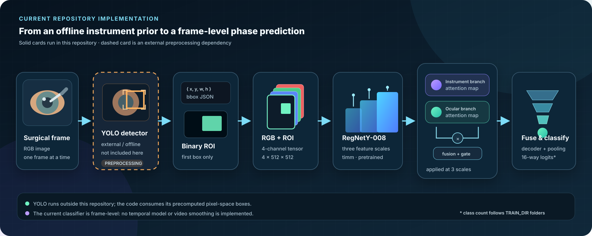
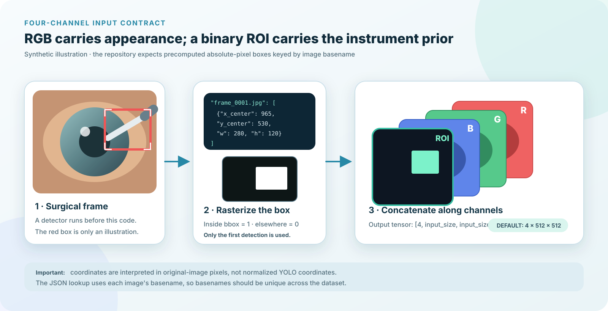

<div align="center">

# RCN-Net: A ROI-Guided Co-Attention Normalization-Free Network for Cataract Surgery Phase Recognition

**Cataract surgery phase classification with offline instrument ROI priors, a 4-channel input, and multi-scale co-attention.**

[](https://ieeexplore.ieee.org/document/11291359)
[](https://pytorch.org/)


</div>

This repository implements the ROI-guided 4-channel input and multi-scale co-attention ideas introduced in **RCN-Net**, using a `timm` **RegNetY-008** backbone. An external YOLO detector supplies instrument bounding boxes; the code rasterizes the first box into a binary ROI mask, appends it to RGB as a fourth channel, and predicts one surgical phase per frame.

> [!IMPORTANT]
> This release is a **paper-inspired research prototype, not an exact reproduction of the NFNet-based paper model**. The paper uses a normalization-free NFNet backbone, while the current code uses RegNetY-008 and contains `BatchNorm2d` in its decoder. Paper metrics below are reference results and have not been independently reproduced by this repository release.

<details>
<summary><strong>中文简介</strong></summary>

本仓库实现了 RCN-Net 中的两项核心思路：将外部 YOLO 检测框栅格化为二值 ROI，并与 RGB 拼接成四通道输入；在三尺度特征上使用双分支 Co-Attention 与空间门控进行帧级手术阶段分类。

当前代码采用 `RegNetY-008`，并非论文中的 NFNet，解码器也包含 BatchNorm。因此它应被视为论文启发的原型实现，不能把论文的 98.48% Accuracy 直接当作本仓库已复现结果。YOLO 训练/推理代码、数据、权重和预计算检测框均未包含在仓库内。

</details>



*The dashed YOLO stage is external. Every solid stage is represented in the current repository.*

## Highlights

- **Explicit spatial prior** - concatenates RGB with a binary instrument ROI mask to form a `[4, H, W]` tensor.
- **Multi-scale features** - extracts three RegNetY-008 feature levels through `timm`.
- **Dual-branch co-attention** - learns instrument-named and ocular-named attention maps at each scale, then applies learned fusion and spatial gating.
- **Single-script workflow** - `main.py` trains when no checkpoint exists, visualizes validation metrics, and writes CSV predictions.
- **Readable data contract** - consumes an ImageFolder training set, a bbox JSON file, and an inference CSV with a `Frame_id` column.

## Current implementation vs. the paper

| Aspect | RCN-Net paper | Current repository |
| --- | --- | --- |
| Backbone | NFNet / `dm_nfnet_f0` | `timm` `regnety_008` |
| Normalization | Designed as normalization-free | Decoder contains `BatchNorm2d` |
| ROI source | Offline YOLOv8 detections | Reads a precomputed bbox JSON; detector code is not included |
| Input | RGB + binary ROI, 4 channels | RGB + binary ROI, 4 channels |
| Attention | Three-scale co-attention + spatial gate | Three `SurgicalCoAttention` modules + spatial gate |
| Optimizer / batch | Adam, batch 48 | AdamW, batch 16 by default |
| Validation protocol | Official 401/95-video split | Unseeded random split of `TRAIN_DIR` using `VAL_RATIO=0.3` |
| Released evidence | Paper tables | No checkpoint, logs, split manifest, or reproduced benchmark in this release |

For the full paper method and reference results, see [RCN-Net at IEEE/CVIP 2025](https://ieeexplore.ieee.org/document/11291359).

## How it works



1. **Detect instruments offline.** Run a detector outside this repository and save bounding boxes in JSON.
2. **Build the ROI channel.** `WrapperSurgicalDataset` looks up the image basename, takes the first detection, and fills its rectangle with ones.
3. **Create a 4-channel tensor.** The binary mask is resized and concatenated after the normalized RGB tensor.
4. **Extract three feature scales.** `SurgicalNet` requests RegNetY-008 feature stages 1, 2, and 3.
5. **Apply co-attention and gating.** Each scale produces two learned attention maps, a fused map, and a spatial gate before a residual update.
6. **Fuse and classify.** Features are aligned to the deepest spatial size, concatenated, decoded, globally pooled, and mapped to class logits.

The implementation is **frame-level**: it does not include temporal modeling, sequence smoothing, or video-level aggregation.

## Repository layout

```text
.
├── main.py                 # Train-or-load, visualize, then run CSV inference
├── requirements.txt
├── README.md
└── src/
    ├── __init__.py
    ├── config.py           # Paths, device, and hyperparameters
    ├── data.py             # ImageFolder split, transforms, ROI construction
    ├── models.py           # SurgicalCoAttention and SurgicalNet
    ├── trainer.py          # AdamW, AMP, scheduler, early stopping
    ├── inference.py        # Checkpoint loading and CSV prediction
    └── visualize.py        # Confusion matrix and per-class accuracy
```

## Installation

```bash
git clone https://github.com/Autopoietic-AI/surgical-yolo4ch-classifier.git
cd surgical-yolo4ch-classifier

python -m venv .venv
source .venv/bin/activate  # macOS / Linux
# .venv\Scripts\Activate.ps1  # Windows PowerShell

python -m pip install -r requirements.txt
```

The dependency file specifies minimum versions rather than a locked, tested environment. Match your PyTorch build to your CUDA/runtime setup. On first use, `timm` may download ImageNet-pretrained RegNetY-008 weights unless they are already cached.

## Prepare the data

### 1. Training images

`TRAIN_DIR` must follow the `torchvision.datasets.ImageFolder` layout. Class directory names must be numeric strings because the current loader calls `int(class_name)`. Zero-padding is recommended to keep the directory order readable.

```text
data/train/
├── 00/
│   ├── frame_000001.jpg
│   └── frame_000002.jpg
├── 01/
│   └── frame_000003.jpg
├── ...
└── 15/
    └── frame_009999.jpg
```

The current training loader does **not** use `VAL_DIR` for validation. Instead, it randomly splits `TRAIN_DIR` according to `VAL_RATIO`.

### 2. Precomputed bbox JSON

The JSON object is keyed by each image's basename. Coordinates are interpreted as **absolute pixels in the original image**, not normalized YOLO coordinates.

```json
{
  "frame_000001.jpg": [
    {
      "x_center": 965.0,
      "y_center": 530.0,
      "w": 280.0,
      "h": 120.0
    }
  ],
  "frame_000002.jpg": []
}
```

Behavior to be aware of:

- Only `detections[0]` is used; confidence scores and additional boxes are ignored.
- A missing or empty detection list creates an all-zero ROI channel.
- Because the lookup uses basenames, filenames should be unique across the dataset.
- This repository does not create the JSON or include YOLO/Ultralytics as a dependency.

### 3. Inference frames and CSV

`VAL_DIR` is the image root used by CSV inference. `CSV_IN` must contain a `Frame_id` column whose values resolve under `VAL_DIR`.

```text
data/inference_frames/
├── frame_100001.jpg
└── frame_100002.jpg
```

```csv
Frame_id
frame_100001.jpg
frame_100002.jpg
```

The output CSV preserves the input columns and adds `Phase_predict`.

## Configure the run

Edit [`src/config.py`](src/config.py) before running:

```python
TRAIN_DIR = r"/absolute/path/to/data/train"
VAL_DIR = r"/absolute/path/to/data/inference_frames"
CSV_IN = r"/absolute/path/to/inference.csv"
CSV_OUT = r"/absolute/path/to/predictions.csv"
JSON_PATH = r"/absolute/path/to/instrument_bboxes.json"
MODEL_PATH = r"/absolute/path/to/best_surgical_model.pth"
```

Default training settings:

| Setting | Default |
| --- | ---: |
| Input size | `512` |
| Batch size | `16` |
| Workers | `26` |
| Epochs | `30` |
| Random validation ratio | `0.3` |
| Early-stopping patience | `5` |
| Learning rate | `1e-4` |
| Weight decay | `1e-4` |
| Device | CUDA if available, otherwise CPU |

## Run the pipeline

```bash
python main.py
```

`main.py` performs the following sequence:

1. Builds the training and random-validation loaders from `TRAIN_DIR`.
2. Loads `MODEL_PATH` and skips training if that file exists; otherwise trains and saves the best validation checkpoint.
3. Opens an interactive confusion matrix and per-class accuracy chart.
4. Reads `CSV_IN`, predicts every `VAL_DIR/Frame_id`, and writes `CSV_OUT`.

There are currently no separate `train`, `evaluate`, or `infer` CLI commands. Even a checkpoint-backed run constructs the training loader first, so `TRAIN_DIR` and the bbox JSON are still required.

## Outputs

| Output | Destination |
| --- | --- |
| Best model state dictionary | `MODEL_PATH` |
| Epoch loss and validation accuracy | Standard output |
| Classification report | Standard output |
| Confusion matrix | Interactive Matplotlib window |
| Per-class accuracy | Interactive Matplotlib window |
| Frame predictions | `CSV_OUT`, column `Phase_predict` |

The visualization functions call `plt.show()` and do not save images automatically.

## Paper-reported reference results

The following numbers come from the CVIP 2025 paper's filtered 16-phase OphNet cataract subset. They describe the paper's NFNet-based RCN-Net, **not a verified run of the current RegNetY repository**.

| Accuracy | Macro precision | Macro recall | Macro F1 |
| ---: | ---: | ---: | ---: |
| **98.48 +/- 0.03%** | **97.50 +/- 0.04%** | **97.74 +/- 0.20%** | **97.62 +/- 0.09%** |

The paper reports an official 401/95-video train/validation split, 1 fps sampling, about 29,760/7,440 frames, 512 x 512 inputs, and 16 retained phases from the original 35. On the 2025 APTOS challenge test distribution without additional fine-tuning, it reports 60.99% video-level accuracy and 30.78% stage-level F1.

To claim reproduction, publish at minimum the exact video-level split, 16-class mapping, bbox generation procedure, random seeds, environment lock, checkpoint checksum, and evaluation script.

## Known limitations and implementation notes

<details>
<summary>Expand the current audit notes</summary>

- The repository is not the paper's normalization-free NFNet model: it uses RegNetY-008 and a decoder with BatchNorm.
- YOLO detection is external, and only the first stored box is consumed.
- Training validation is an unseeded random frame split of `TRAIN_DIR`; `VAL_DIR` is used only by CSV inference.
- RGB training transforms include random rotation and cropping, while the ROI mask is independently resized from the original image. The two can become spatially misaligned.
- The additional HSV/LAB-derived mask term is added as `mask_weight * masks.mean()`. It does not depend on model output and therefore contributes no gradient to model parameters.
- The code performs frame classification only and does not model surgical phase transitions over time.
- If training runs, the interactive evaluation uses the final in-memory model rather than explicitly reloading the best checkpoint; CSV inference reloads the checkpoint.
- Paths are hard-coded in `src/config.py`; there is no argument parser or environment-based configuration.
- No dataset, detector, bbox file, pretrained classifier weight, experiment log, automated test, or CI workflow is included.

</details>

## Suggested path to reproducibility

- Align geometric transforms for RGB and ROI masks.
- Add a fixed seed and a video/patient-level split manifest.
- Separate `train`, `evaluate`, and `infer` commands.
- Release the 16-phase label mapping, detector configuration, and bbox schema.
- Save machine-readable metrics and plots; publish checkpoint and manifest checksums.
- Add smoke tests for tensor shapes, class ordering, JSON parsing, and checkpoint loading.
- Either align the model with the NFNet paper architecture or keep the paper-vs-code distinction explicit.

## Dataset, privacy, and clinical use

The repository does not distribute OphNet/APTOS videos or annotations. Obtain data from the official provider and follow its terms, consent requirements, and privacy controls:

- [OphNet benchmark](https://github.com/minghu0830/OphNet-benchmark)
- [APTOS Ophthalmology Challenge](https://ophnet-challenge.github.io/)

This software is a research prototype. It is **not a medical device** and must not be used for diagnosis, treatment decisions, or unsupervised intraoperative guidance.

The diagrams under `docs/images/` are original, synthetic, code-oriented illustrations. No clinical frame from the publisher PDF is redistributed here.

## Citation

If this work is useful in your research, cite the paper:

```bibtex
@inproceedings{bai2025rcnnet,
  title     = {RCN-Net: A ROI-Guided Co-Attention Normalization-Free Network for Cataract Surgery Phase Recognition},
  author    = {Bai, Haotian and Li, Tianhao and Zhao, Ben and Zhang, Yawen and
               Lou, Junsen and Liu, Qing and Shi, Xuzi and Wang, Yitong and
               Wang, Yaqi and Zhang, Suiyu},
  booktitle = {2025 International Conference on Computer Vision, Image Processing
               and Computational Photography (CVIP)},
  pages     = {238--243},
  year      = {2025},
  doi       = {10.1109/CVIP67348.2025.11291359}
}
```

## License

No license file is currently declared in this repository. Public visibility does not itself grant permission to use, modify, or redistribute the code. Maintainers should add an explicit license before third-party reuse.

## Acknowledgments

The paper reports support from the National Natural Science Foundation of China (No. 62206242) and the Zhejiang Provincial Natural Science Foundation of China (No. LTGG24F030002).

For research questions, contact the paper authors at `baihaotian12@gmail.com` or `zhangsuiyu@cuz.edu.cn`.
